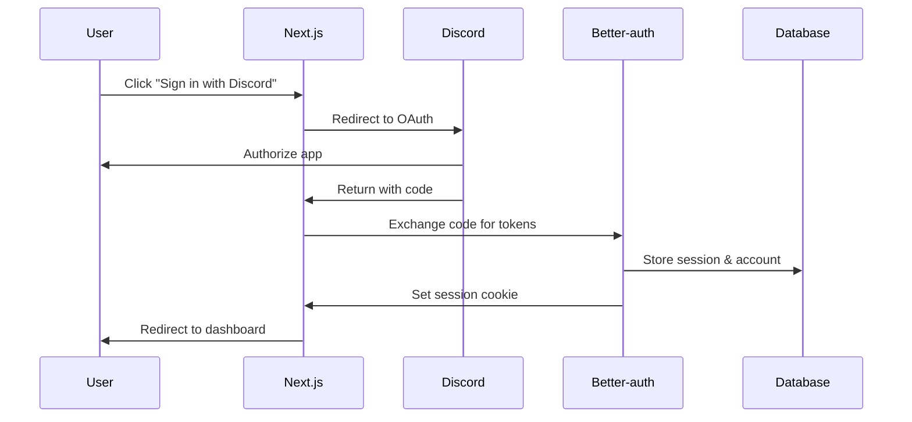
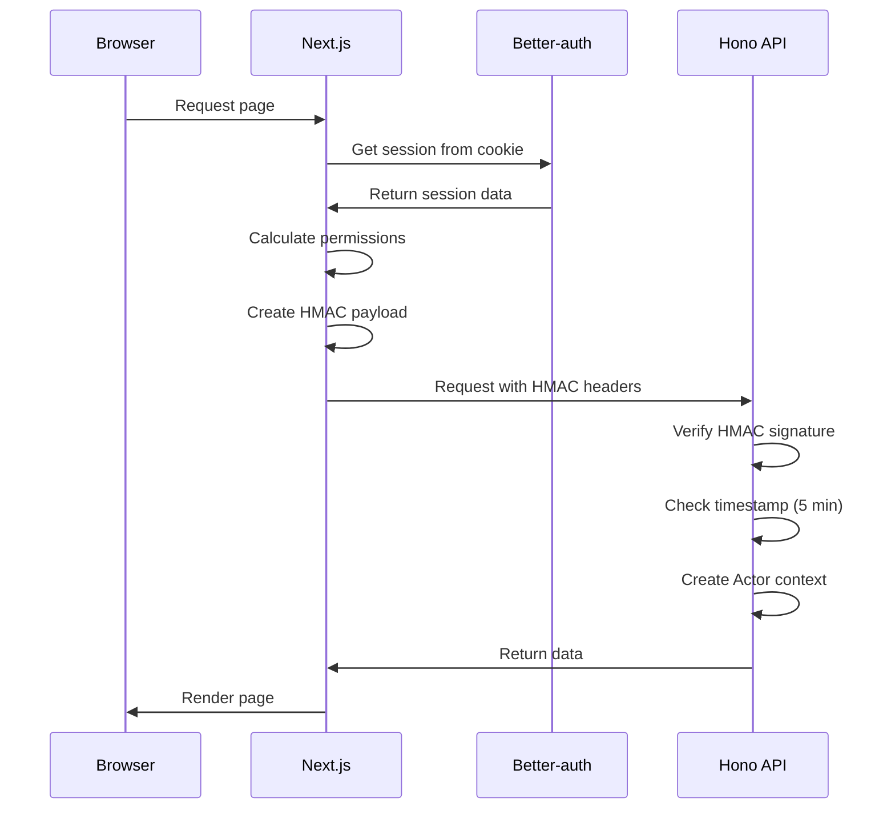

# Authentication Flow Documentation

## Overview

The TicketsBot authentication system uses a hybrid approach:
- **Better-auth** for Discord OAuth and session management
- **Next.js API Routes** for handling auth endpoints
- **HMAC signatures** for secure server-to-server communication

## Architecture

### 1. Client-Side Authentication (Browser → Next.js)

```
Browser → Next.js /api/auth/* → Better-auth → Database
```

- User signs in via Discord OAuth
- Better-auth creates session and stores in database
- Session cookie set with 1-hour cache, 7-day expiry
- Cookie domain: `.ticketsbot.co` (production) or `localhost` (development)

### 2. Server-Side Authentication (Next.js SSR → Hono API)

```
Next.js getServerSideProps → HMAC signed request → Hono API
```

- Next.js reads session from Better-auth
- Creates HMAC payload with user data and permissions
- Signs payload with `API_SECRET` environment variable
- Sends as `X-Auth-Payload` and `X-Auth-Signature` headers

### 3. HMAC Payload Structure

```typescript
interface HmacPayload {
  userId: string;
  email: string;
  discordUserId: string | null;
  selectedGuildId?: string;
  permissions?: string;  // BigInt as string
  sessionId: string;
  expiresAt: string | Date;
  timestamp: number;     // For replay protection
  
  // Additional fields
  username?: string | null;
  discriminator?: string | null;
  avatar_url?: string | null;
  name?: string;
}
```

## Security Features

### HMAC Signature Verification

1. **Signature Algorithm**: SHA256 HMAC
2. **Replay Protection**: 5-minute timestamp window
3. **Payload Encoding**: Base64 for transport
4. **Secret Validation**: Fails on startup if `API_SECRET` not set in production

### Session Management

1. **Cookie Cache**: 1-hour cache to reduce database queries
2. **Database Storage**: All sessions persisted to PostgreSQL
3. **Fast Path**: Returns cached Discord data when available
4. **Slow Path**: Only fetches from database when data is missing

## Configuration

### Required Environment Variables

```env
# Authentication
BETTER_AUTH_SECRET=32-character-random-string
API_SECRET=your-hmac-secret-key

# Discord OAuth
DISCORD_CLIENT_ID=your-discord-app-id
DISCORD_CLIENT_SECRET=your-discord-app-secret

# URLs
WEB_URL=http://localhost:9000
API_URL=http://localhost:9001
```

### Turbo.json Configuration

The `API_SECRET` must be included in both `dev` and `start` tasks:

```json
{
  "dev": {
    "env": ["API_SECRET", "..."]
  },
  "start": {
    "env": ["API_SECRET", "..."]
  }
}
```

## Authentication Flow Sequence

### 1. Initial Discord OAuth



### 2. Server-Side API Request



## Key Files

### Web Application
- `/apps/web/pages/api/auth/[...all].ts` - Better-auth catch-all route
- `/apps/web/lib/auth-client.ts` - Client-side auth utilities
- `/apps/web/lib/server-auth.ts` - Server-side session management
- `/apps/web/lib/api-server.ts` - HMAC client creation
- `/apps/web/lib/hmac.ts` - HMAC signature utilities

### API Application
- `/apps/api/src/middleware/context.ts` - HMAC verification middleware
- `/apps/api/src/index.ts` - Auth route mounting

### Core Package
- `/packages/core/src/auth/auth.ts` - Better-auth configuration
- `/packages/core/src/auth/services/session.ts` - Session utilities

## Common Patterns

### Getting Session in Next.js Pages

```typescript
import { withGuildRoute } from "@/lib/with-auth";
import { createServerApiClient } from "@/lib/api-server";

export const getServerSideProps = withGuildRoute(
  async (context, session, guildId, guilds) => {
    // API client with HMAC auth
    const api = await createServerApiClient(context.req, guildId);
    
    // Make authenticated requests
    const response = await api.tickets.$get();
    
    return { props: { /* ... */ } };
  }
);
```

### Verifying Permissions

```typescript
// In API middleware
const permissions = payload.permissions ? BigInt(payload.permissions) : 0n;

// Check specific permission
if ((permissions & PermissionFlags.TICKET_VIEW_ALL) !== PermissionFlags.TICKET_VIEW_ALL) {
  throw new VisibleError("permission_denied", "Missing required permission");
}
```

## Troubleshooting

### Common Issues

1. **"State Mismatch" Error**
   - Clear browser cookies and local storage
   - Ensure WEB_URL and API_URL are correctly configured

2. **HMAC Signature Invalid**
   - Verify API_SECRET matches between web and API
   - Check timestamp isn't older than 5 minutes
   - Enable debug logging to see signature comparison

3. **Session Not Found**
   - Check BETTER_AUTH_SECRET is set
   - Verify database connection
   - Clear cookie cache if stale

### Debug Logging

In development, HMAC validation logs include:
- Signature validation result
- First 16 characters of signatures for comparison
- Payload length
- Timestamp age

Enable with `LOG_LEVEL=debug` environment variable.

## Migration Notes

This authentication system replaces the previous approach where:
- API handled auth directly via `/auth/*` routes
- No HMAC was used for server-to-server communication
- Sessions were passed via cookies to the API

The new approach provides:
- ✅ Better separation of concerns
- ✅ Reduced API surface area
- ✅ Pre-calculated permissions in HMAC payload
- ✅ Replay attack protection
- ✅ Proper session caching